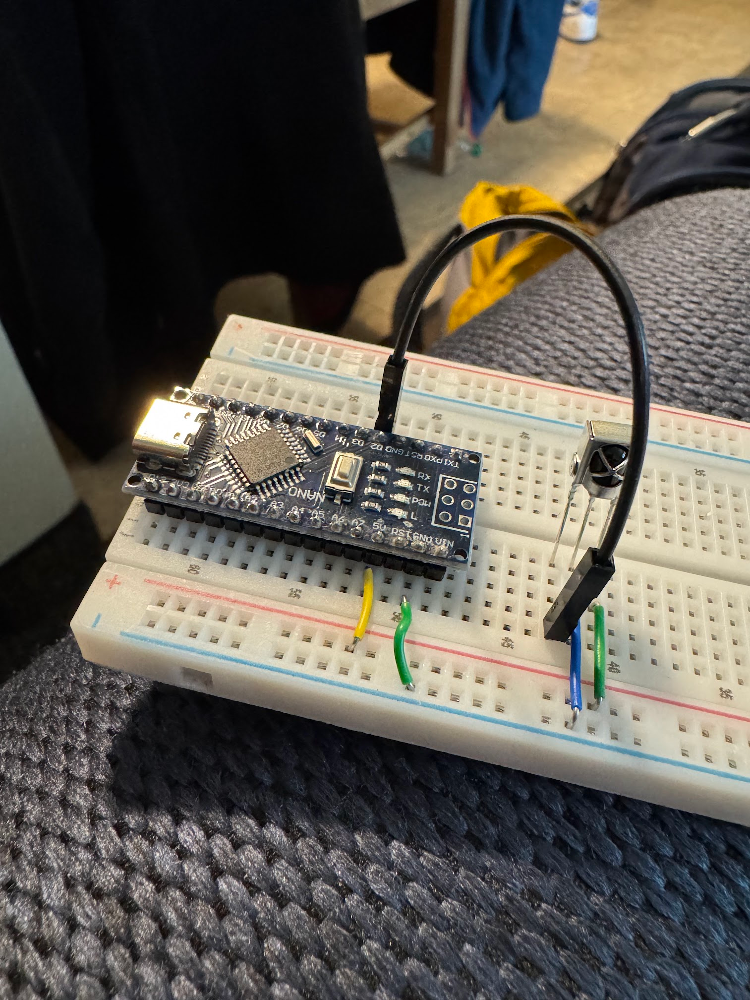
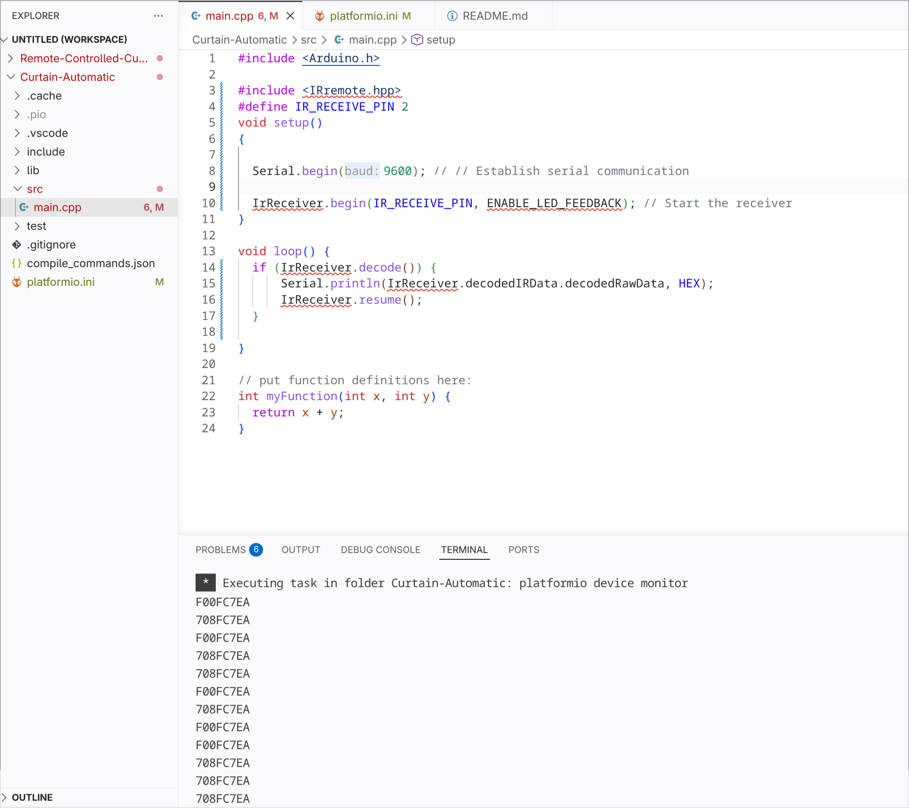
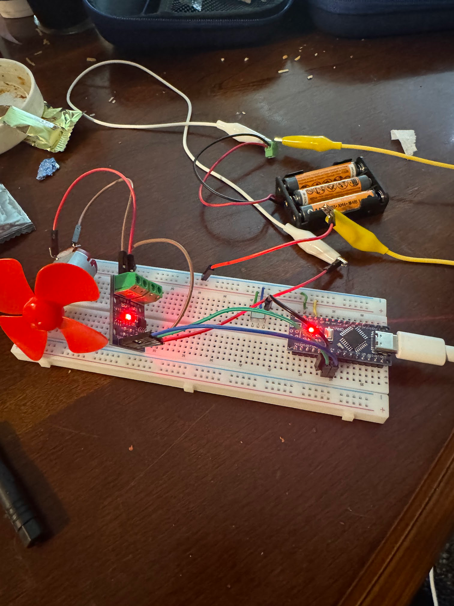

# Remote-Controlled-Curtain-Opener
This is a EE project which involves the use of motors, microcontrollers, and IR signals to make a curtain controller. OVer time this will be updated with each step I took to make this
work the way I want it. At this point I have bought most of the parts and started to think about the best way to implement it.

## Getting the Materials:
Since the function of the device is not very complicated, I went ahead and bought all the parts that I think I'll need, this includes a breadboard, IR receivers and transmitters, 
an arduino nano microcontroller, and the motors, cables, and a few smaller controllers (OP Amps, inverters, MOSFETS, etc).

## Setting up Computer:
Since I am not doing this project on a windows or macOS device, it is easier for me to use the platformIO extension for the coding and testing.
### PROBLEMS:
- At first the computer was not communicating with the nano, luckily I was able to fix it by giving my user permission in my linux system
- The library seemed to not be working, but after some thinkering I realized that it was working, but for some reason it's showing as an issue in my VS Code, gonna look into fixes later.

## First Milestone:
- IR sensor was connected to the correct pinouts in the arduino, I chose digital pin 2 for communication with the sensor. The circuit looks like the image provided below.

The code written is extremely simple, all it does is print on the serial monitor all the inputs it receives. Here is some of the printing by me using my home remote to send out signals towards the sensor.

<<<<<<< HEAD
Updating methods!
Buying each component individually was getting expensive and the cables were getting messy, so I wanna take the opportunity to get hands on KiCad and learn some PCB design so I can get a working prototype:

=======
## Milestone Two:
Today I plugged in the motor into the system, to test it I used digital pins 3 and 4. In the code it can be seen that I used an H-Bridge to connect to the motor, my original plan was to make my own as a challenge but I couldn't find all the pieces and have them arrive in a timely manner. The code today was simple, motor would spin to the left for 1 second, then stop for one second, then spin to the right for one second, and then stop. It would just repeat that over and over, this is the circuit currently, next milestone we will connect it to the analog pins and use PWM to spin the motor for a better time.

>>>>>>> ee3f9d9 (finishing up the coding)

